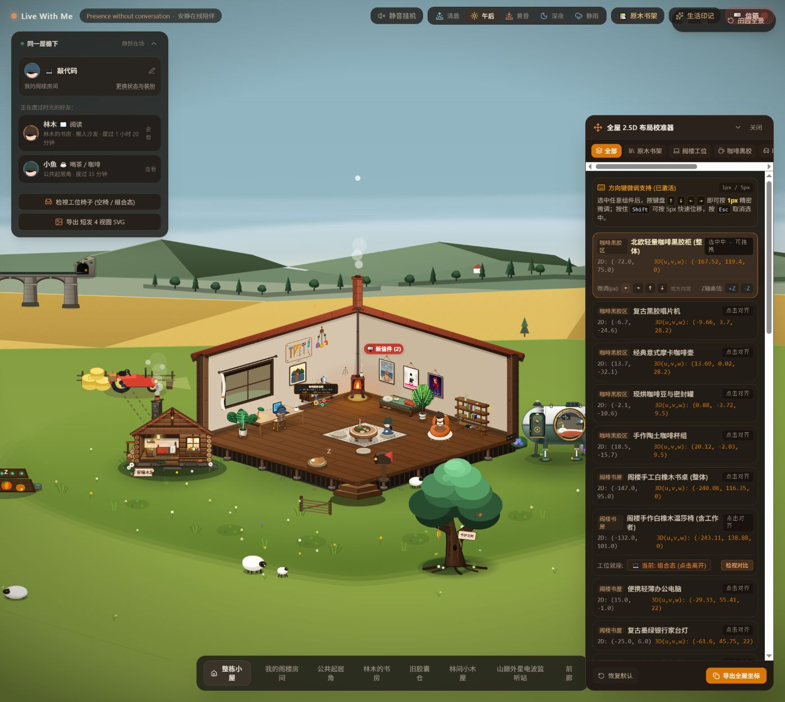

# npm 工具迁移执行记录

本批对应《Live With Me 重构执行计划》第 2 节，仅完成 npm 迁移及本地验证。AI Studio 实际拉取运行尚未验证，因此兼容门槛仍为 **待通过**；P0–P7 尚未开始。

## 变更与版本基线

- 基线提交：`d332c394df6b7e2864ac89cb53bee2ba6ebffe1c`。
- 工作分支：`codex/npm-compatibility`。
- 新增 `package-lock.json`，移除 `bun.lock`，保留 `package.json` 的依赖范围、全部脚本、端口和 `vite.config.ts` 的 `DISABLE_HMR` 处理。
- 迁移前的 Node 为 `v24.14.0`，npm 为 `11.9.0`。这些是本机验证版本，没有在应用中新增运行时版本约束。
- `npm-migration-baseline.json` 记录迁移前 19 个直接依赖、222 个已安装包实例、原 Bun 锁文件中的 318 个唯一包版本及文件摘要。manifest 同时记录原始摘要和忽略 CRLF/LF 差异的摘要。
- 新锁文件包含 325 个包实例；现有 222 个包实例版本全部保持，新加 103 个实例全部属于跨平台可选依赖及其依赖。锁文件补齐了版本、下载地址和完整性信息，覆盖 Linux 原生构建依赖。

迁移前已安装依赖与 `bun.lock` 已经存在差异，例如已安装 `@google/genai@2.24.0`、`three@0.186.1`、`tsx@4.23.15`，原 Bun 锁文件为 `2.21.0`、`0.186.0`、`4.23.13`。本批以迁移前实际构建所用的已安装版本为基线，没有借迁移升级应用依赖。回退后 Bun 按原锁文件全新安装会恢复原锁版本，而非这次保留的本机已安装版本。

## 本地验证结果（2026-10-07，Windows）

全新安装在独立 `.npm-migration` 目录进行，避免删除原工作区的 `node_modules`。该目录只复制 manifest、锁文件和构建所需源文件；没有复用原 `node_modules`。验证完成后临时目录已清理。

| 检查 | 结果与证据 |
| --- | --- |
| 全新 `npm ci --no-audit --no-fund` | 通过，安装 222 个包，安装脚本正常执行 |
| 包版本复核 | 通过，锁文件和全新安装的包文件均与 222 个基线实例一致 |
| `npm run lint` | 通过，`tsc --noEmit` 无错误 |
| `npm run build` | 通过，Vite 6.4.3，1750 个模块 |
| 构建产物对比 | 全新安装与迁移前构建的 JS、CSS SHA-256 完全一致 |
| 本地开发预览 | `DISABLE_HMR=true` 下以原 dev 脚本、端口 3000 启动成功 |
| 房间导航 | 八个入口均切换到原有相机位置，详见下表 |
| 家具编辑与刷新 | 柜体 X 从 -72 微调至 -71，刷新保留；再微调回 -72，恢复原坐标 |
| 浏览器日志 | 此次本地导航、编辑检查未捕获 warning/error |
| AI Studio GitHub 拉取与运行 | **未执行**，本批没有外部推送或同步 |

本地检查是本批的人工冒烟验证，不替代 P0 的确定性截图和自动化测试。没有新增测试依赖、安装 Playwright 或修改应用业务文件。

| 入口 | translation | zoom |
| --- | --- | --- |
| 我的阁楼房间 | (220,150) | 1.55 |
| 公共起居角 | (20,130) | 1.55 |
| 林木的书房 | (-180,140) | 1.55 |
| 旧胶囊仓 | (-280,60) | 1.6 |
| 林间小木屋 | (210,-30) | 1.6 |
| 山巅外星电波监听站 | (-380,30) | 1.6 |
| 前廊 | (40,-80) | 1.5 |
| 整栋小屋 | (0,135) | 0.66 |

所有相机原点均保持 `(600,400)`。以下截图显示全新 npm 安装下的页面与恢复后的柜体坐标；该截图不是视觉回归基线。



构建大小：CSS 64.72 kB / gzip 12.24 kB；JS 806.80 kB / gzip 211.22 kB。Vite 的 500 kB chunk 提示仍存在；加载优化留待 P7。

```text
index-BdvSHRh4.css SHA-256
8934896294f9eaea9df3708f395f60445b68d5479ff325288c0817e03355b166
index-Cqi1D6es.js SHA-256
a59c25a6c8adc52570092b6b19f7570f8ed4e2d9ccf9458f109431b851af5c40
```

## 复核与平台门槛

复核锁文件不需要额外依赖：

```powershell
node scripts/verify-npm-migration.mjs
```

若需要重现本地完整验证，在全新检出的迁移分支中执行：

```powershell
npm ci --no-audit --no-fund
node scripts/verify-npm-migration.mjs .
npm run lint
npm run build
$env:DISABLE_HMR = 'true'
npm run dev
```

带安装目录参数的校验用于本批 Windows 基线重现。其它操作系统可运行不带参数的锁文件检查；平台可选包的实际安装集合不同，不应要求与 Windows 的 222 个实例完全相同。该脚本是迁移冻结门槛，后续正式新增测试依赖时需同步调整或移除。

Google 官方文档确认 Node.js/npm 包支持和 GitHub 拉取能力，但没有保证导入时的锁文件选择策略。相关说明：[AI Studio Build mode](https://ai.google.dev/gemini-api/docs/aistudio-build-mode)、[Full-stack apps](https://ai.google.dev/gemini-api/docs/aistudio-fullstack)。本地锁文件检查只证明 Linux 原生包元数据完整，没有验证 Linux/AI Studio 实际运行。

后续获授权的同步阶段需要：

1. 推送这份独立工具迁移提交，并在 AI Studio 拉取，核对实际提交 SHA。
2. 确认平台使用 npm 锁文件完成依赖安装，预览启动成功，记录其 Node/npm 版本与安装结果。
3. 检查八个房间入口、家具编辑及刷新；确认 `DISABLE_HMR` 环境下仍能预览。
4. 成功后登记平台证据，门槛通过再进入 P0。失败则回退工具迁移提交，准备 Bun 环境并复核后继续；不能用后续业务修改绕过安装失败。

## 回退

工具迁移独立提交的主题为 `chore: migrate dependency lock to npm`。对该提交执行 `git revert <迁移提交 SHA>` 即可恢复原 `bun.lock`、撤销 npm 锁文件及本批验证文件。原业务代码及 `live_with_me_room_layout_v6` 结构未改动；无须清空或转换布局。

本轮没有执行外部推送、AI Studio 同步或回退；本地验证通过不等于整轮架构重构完成。
